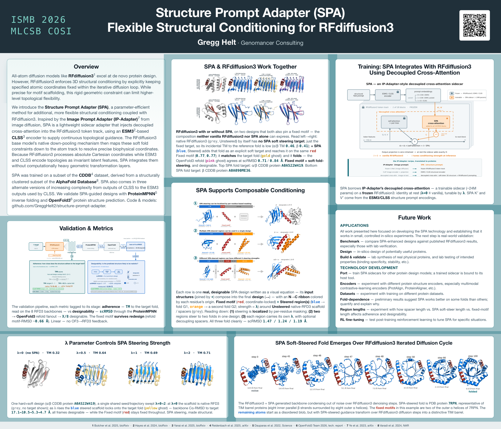

[](docs/poster/SPA_ISMB2026_poster_FINAL.pdf)

# Structure Prompt Adapter (SPA)

**Flexible structural conditioning for RFdiffusion3.**

SPA is a parameter-efficient *sidecar* adapter for [RFdiffusion3](https://github.com/RosettaCommons/foundry)
that injects **decoupled cross-attention** into RFdiffusion3's token track, letting you steer the *coarse
fold topology* of a generated protein with a soft **structural prompt** — while RFdiffusion3's native
machinery (including hard, coordinate-pinned motif constraints) is left untouched. It is analogous to
[IP-Adapter](https://github.com/tencent-ailab/IP-Adapter) in image-diffusion workflows.

> The initial research in this repo was presented as a poster at **ISMB 2026** (July 12–16, Washington DC) —
> [full poster PDF](docs/poster/SPA_ISMB2026_poster_FINAL.pdf). SPA source code and trained models are both
> included in this repo.

**Highlights**

- **Hard ⊕ soft conditioning (the headline).** Pin a motif's coordinates — RFdiffusion3's native *hard*
  constraint — *and* steer the surrounding fold with a *soft* structural prompt in the same design: a
  constrained design neither vanilla RFdiffusion3 nor SPA alone can express.
- **Non-destructive & tunable.** A zero-init gate makes `λ = 0` an exact identity with vanilla RFdiffusion3;
  the scalar `λ` tunes conditioning strength at inference.
- **Prompt-specific, validated in silico.** Steering follows the *actual* prompt (control experiments confirm
  it), and designs are validated via ProteinMPNN → OpenFold3.
- **Three encoder variants** (per-residue N×1536 / mean-pool 1×1536 / CLSS-bottleneck 1×32) — near-equivalent,
  so the cheapest holds its own.

---

## Abstract (ISMB 2026)

All-atom diffusion models like RFdiffusion3 excel at de novo protein design. However, RFdiffusion3 enforces 3D
structural conditioning by explicitly keeping specified atomic coordinates fixed within the iterative diffusion
loop. While precise for motif scaffolding, this rigid geometric constraint can limit higher level topological
flexibility. Here we introduce the Structure Prompt Adapter (SPA), a parameter-efficient method enabling
additional, more flexible structural conditioning when coupled with RFDiffusion3. Inspired by the Image Prompt
Adapter (IP-Adapter) used in image diffusion workflows, SPA is a lightweight sidecar model that injects
decoupled cross-attention into the RFdiffusion3 token track. It uses the Contrastive Learning Sequence-Structure
(CLSS) encoder for encoding its additional structural prompts. This effectively guides coarser fold topology,
while the native RFDiffusion3 cross-attention between atom level and token level tracks translates this guidance
to the atom level track for positioning. Because RFdiffusion3 natively processes absolute Cartesian coordinates
and CLSS encodes geometric topologies as invariant latent features, SPA can integrate these representations
without computationally heavy geometric transformation layers. Trained on diverse 3D structures, SPA uses
extensive data augmentation to learn spatial symmetries. We also train alternate versions of SPA that use only
the outputs of CLSS or deeper layers within CLSS connected to trainable layers in SPA. To validate SPA-guided
output, we utilize ProteinMPNN for inverse-folding sequence design, followed by in silico validation using
OpenFold3. We compare and contrast specific examples of protein design using RFdiffusion3 with or without SPA.
Source code and models are available at: github.com/GreggHelt2/structure-prompt-adapter.

---

## How it works

- **Sidecar, not a fork.** SPA wraps each of RFdiffusion3's token-track attention blocks (its
  `LocalAttentionPairBias` layers) and adds a decoupled cross-attention term
  `λ · SPA(query=design, key/value=prompt)` to the existing residual —
  the IP-Adapter `Z = Z_self + λ · Z_prompt` pattern, realized by module wrapping. RFdiffusion3 stays frozen.
- **Identity at rest.** The adapter's output projection is **zero-initialized**, so at `λ = 0` the SPA term is
  exactly zero and a wrapped model computes the **same function** as vanilla RFdiffusion3 (enforced by an
  identity-at-init test; empirically `λ = 0` shifts adherence by `dTM = −0.005`, i.e. nothing). `λ` is the
  inference strength knob, swept at runtime.
- **The prompt.** A structural prompt (a reference protein) is encoded by **ESM3 / CLSS** into an
  SE(3)-invariant latent and projected into SPA's key/value space — no equivariant machinery needed.
- **Hard ⊕ soft.** SPA's soft fold-prompt **composes with** RFdiffusion3's *native* hard motif constraints
  (coordinates pinned in the diffusion loop): the motif stays exactly satisfied while SPA steers the
  surrounding scaffold toward the prompt fold — a constrained design neither vanilla RFdiffusion3 nor
  SPA-alone can express.

### Variants (the "alternate versions")

All three consume the same frozen ESM3 structure-tower embedding `[N, 1536]`; they differ only in the
front-end projector:

| variant | Hydra config | prompt shape | description | checkpoint |
|---|---|---|---|---|
| **N×1536** | `variant=C_n_by_1536` | per-residue | raw, unpooled ESM3 embedding (finest-grained) — the primary variant | `models/spa-Nx1536-uncond.pt` |
| **1×1536** | `variant=B_1_by_1536` | global | mean-pooled ESM3 embedding | *(not yet published — see [`models/README.md`](models/README.md))* |
| **1×32** | `variant=A_1_by_32` | global | the CLSS contrastive bottleneck embedding (cheapest) | `models/spa-1x32-uncond.pt` |

Four trained checkpoints ship in [`models/`](models/README.md) — including a motif-curriculum and a
multigranularity (sub-region) variant of N×1536. See [`models/README.md`](models/README.md) for which one to
use, SHA-256 checksums, and why the file sizes are *not* in the order you'd expect.

---

## Selected results

*(Distributional, self-consistency validation; see the poster for full detail.)*

- **Does no harm at rest.** `λ = 0` reproduces vanilla RFdiffusion3 (the zero-init gate).
- **A tunable, interpretable knob.** Adherence to the prompt fold rises smoothly and monotonically with `λ`;
  the designability cost is **fold-structured** — nearly free when steering *with* RFdiffusion3's helix-rich
  prior (α/β folds), bounded and `λ`-tunable when steering *against* it (all-β).
- **Hard ⊕ soft, across 15 held-out folds.** The native motif is satisfied **100%** of the time (Cα motif-RMSD
  ≈ 0.018 Å) — that pin is a *guarantee* of RFdiffusion3's revealed-coordinate freeze rather than a discovery;
  the result is that the soft prompt **does not disturb it** while shifting the surrounding fold toward the
  prompt on most folds (strongest on β), and the pinned motif **survives inverse-folding and refolding**
  (median 0.66 Å). Notably, an adapter trained *only* on unconditional fold-steering composes with a hard
  motif **zero-shot**, matching one trained with a motif curriculum. On the hardest (all-β) folds — against
  RFdiffusion3's helix-rich prior — the soft prompt can even **improve** designability, since steering toward
  the real β fold beats the unconditional attempt.
- **Prompt-specific.** Control experiments confirm the fold-steering *requires and follows* the actual
  structural prompt: a null (learned) prompt produces no steering, and a **mismatched** prompt steers the
  design toward the *wrong* fold — the effect is not a generic "the adapter always helps" artifact.
- **Variant-robust.** N×1536 ≈ 1×1536 ≈ 1×32 across the held-out folds, on **both** adherence and
  designability — the cheap CLSS-bottleneck variant holds its own against the per-residue one.
- **Localized and composable (partially).** A per-residue `λ` profile steers a *sub-region* of a design, and
  multiple prompts can address different regions of one design — two regions steered toward two different
  folds, alongside a hard-pinned motif, without bleed between them. Localization is **partial and
  ratio-gated**: the frozen host drags the unsteered region along unless the steered region is a moderate
  fraction (~⅓–½) of the design at gentle `λ`.

---

## Installation

Get a working SPA + RFdiffusion3 environment with one script:

    bash scripts/setup/install_env.sh

This creates a conda environment (`spa`, Python 3.12), installs the validated combination of PyTorch
(2.5.1+cu124), RFdiffusion3 (via the `foundry` package), `atomworks`, and ESM3 as editable installs from
pinned commits, installs this package itself, and downloads the RFdiffusion3 base checkpoint. Add
`--with-clss` if you want the 1×32 CLSS-framed variant too. Requires conda and an NVIDIA GPU with a
CUDA 12.4-compatible driver.

SPA's own trained adapter weights are already included in this repo, under `models/` (see
[`models/README.md`](models/README.md) for which one to use, the SHA-256 checksums, and why the file sizes
are not in the order you'd expect).

**Note:** ESM3 weights auto-download from Hugging Face on first use. Even though they're MIT-licensed
and ungated, you still need a free Hugging Face account and a Read token (`huggingface-cli login`).

Both setup scripts place the dependency repos and downloaded weights under `$SPA_PROJECT_ROOT` (an env var,
default `$HOME/projects/spa`) rather than inside this repo — this matches the layout the Hydra configs
(`configs/paths/default.yaml`) already expect, so no path overrides are needed at run time. Set
`SPA_PROJECT_ROOT` yourself if you'd rather use a different location (just set it consistently for both
install and run time).

SPA itself is a small package (Hydra + the SPA source); its heavy dependencies are large research codebases
installed separately. **`pip install -e .` deliberately does not pin them** so it cannot disturb a
GPU-validated stack — that pinning lives in the setup scripts above.

**Tested with** — two stacks that deliberately share the same core (**torch 2.5.1 + cu124, Python 3.12**) for
monkeypatch parity. These are *reference* environments, not hard pins:

- **Local — A5000 (Ampere, sm_86):** conda env with editable installs — Python 3.12, torch 2.5.1+cu124,
  numpy 2.x; atomworks 2.2.1, rc-foundry 0.2.1.dev4 (`[rfd3]`), esm 3.3.0, clss-model 0.4.1.
- **Cloud — H100 (Hopper, sm_90):** a `python:3.12-slim` container (pip + a constraints file) — Python 3.12,
  torch 2.5.1+cu124 (CUDA 12.4 runtime), same core deps. OpenFold3 validation runs in an isolated env with
  triton 3.1.0 (openfold3 @ `e583ecee`).

---

## Usage

All entry points are [Hydra](https://hydra.cc) apps — every knob (variant, `λ`, K, prompt, checkpoint,
paths) is a CLI override; nothing hardware-specific is hardcoded.

**Generate designs (RFdiffusion3 ± SPA), λ-sweep:**
```bash
conda activate spa
python scripts/eval/generate.py \
    variant=C_n_by_1536 eval.ckpt=models/spa-Nx1536-uncond.pt \
    eval.prompt_pdb=/path/to/prompt.pdb 'eval.conditions=[baseline,spa]' \
    'eval.lambda_scale=[0.5,1.0,2.0]' eval.num_designs=8 eval.length=150
```

**Hard ⊕ soft** (a native motif scaffold + the soft SPA prompt) — add an `eval.motif`:
```bash
python scripts/eval/generate.py \
    variant=C_n_by_1536 eval.ckpt=models/spa-Nx1536-uncond.pt \
    eval.prompt_pdb=/path/to/prompt.pdb +eval.motif.source_pdb=/path/to/prompt.pdb \
    "+eval.motif.contig='5,A6-14,118,A133-140,10'" \
    'eval.conditions=[baseline,spa]' 'eval.lambda_scale=[2]'
```
`spa-Nx1536-uncond` composes with a hard motif zero-shot; `models/spa-Nx1536-motif.pt` is the checkpoint
trained explicitly on the motif curriculum, and performs about the same.

---

## Validation pipeline (ProteinMPNN → OpenFold3)

SPA is evaluated with a self-consistency "flywheel": **RFdiffusion3 ± SPA** generates backbones →
**ProteinMPNN** inverse-folds them → **OpenFold3** predicts structures from those sequences → scoring against
the prompt and the motif. Metrics: **TM-score** (prompt adherence), **scRMSD** (designability /
self-consistency), and **motif-RMSD** (hard-constraint satisfaction).

The scoring stack needs a second, separate environment:

    bash scripts/setup/install_validation_env.sh

This creates a `spa-verify-of3` conda environment with ProteinMPNN (cloned, no install needed — it
runs as a script with bundled weights) and OpenFold3 (editable install + downloaded checkpoint). It's
kept separate from the `spa` inference environment since OpenFold3's dependencies don't need to
coexist with RFdiffusion3/ESM3, and OpenFold3 wants substantially more VRAM (**32GB+ recommended** —
its own docs cite an A100 40GB as typical, well beyond what the inference tier needs).

Run the full pipeline from the **inference** env — it shells out to `spa-verify-of3` automatically for
both downstream steps, no manual environment switching required:

```bash
conda activate spa
python scripts/eval/run_flywheel.py \
    variant=C_n_by_1536 eval.ckpt=models/spa-Nx1536-uncond.pt \
    eval.prompt_pdb=/path/to/prompt.pdb 'eval.conditions=[baseline,spa]' \
    'eval.lambda_scale=[0.5,1.0]' eval.num_designs=8 eval.length=100 \
    eval.proteinmpnn.conda_env=spa-verify-of3 \
    +eval.flywheel.refolder._target_=spa.eval.openfold3.OF3Refolder \
    +eval.flywheel.refolder.ckpt_path=${paths.openfold3_ckpt} \
    +eval.flywheel.refolder.runner_yaml=${paths.openfold3_runner_yaml} \
    +eval.flywheel.refolder.out_dir=${eval.out_dir}
```

Results (per-condition designability + adherence, aggregated) land in `<out_dir>/flywheel_results.json`.
Without the `refolder` overrides the flywheel runs adherence-only (no OpenFold3).

---

## Repository layout

```
src/spa/
  model/       SPA cross-attention, the RFdiffusion3 block wrappers, variant projectors, loader
  prompt/      ESM3 structural-prompt producer
  data/        CDDB dataset, splits, augmentation, native-conditioning curriculum
  train/       training harness (frozen RFdiffusion3 host + trainable SPA)
  eval/        validation flywheel: generate -> ProteinMPNN -> OpenFold3 -> score (TM / scRMSD / motif-RMSD)
configs/       Hydra configs (model / variant / data / train / eval / of3 / hardware / paths)
scripts/
  setup/       one-script environment installers (inference + validation)
  eval/        generate, run_flywheel, ladder, region/composition probes, result aggregation
  cloud/       Vertex AI job submission + run scripts (H100)
  train.py, build_splits.py, gen_esm3_cache.py
models/        published SPA adapter weights (+ models/README.md)
docs/poster/   the ISMB 2026 poster (PDF + thumbnail)
tests/         unit + integration tests (incl. the identity-at-init gate)
```

---

## License

**Apache License 2.0** — covering both the SPA source and the released SPA model weights (© 2026 Gregg Helt;
see [LICENSE](LICENSE) and [NOTICE](NOTICE)). SPA depends on **RFdiffusion3** (BSD-3) and is conditioned on
**ESM3** embeddings (MIT, Chan Zuckerberg Biohub); its validators **ProteinMPNN** (MIT) and **OpenFold3**
(Apache-2.0) are likewise permissive — so SPA may be used commercially. The trained weights were built on the
**CDDB** dataset (**CC-BY-4.0**; commercial use permitted with attribution, recorded in [NOTICE](NOTICE)).
Please honor the upstream licenses (RFdiffusion3 / foundry, ESM3, CLSS, ProteinMPNN, OpenFold3) and CDDB's
attribution requirement.

## Acknowledgments

Built on RFdiffusion3 (RosettaCommons/foundry), ESM3 (Chan Zuckerberg Biohub), CLSS, ProteinMPNN, and
OpenFold3, and inspired by IP-Adapter. Training data: the Consistency-Distilled Synthetic Protein Database
(CDDB / Proteína-Atomística, CC-BY-4.0). See [NOTICE](NOTICE) for full attributions.

## Citation

If you use SPA, please cite the ISMB 2026 poster:

> Helt, G. (2026). Structure Prompt Adapter (SPA): Flexible Structural Conditioning for RFdiffusion3.
> Poster, ISMB (Intelligent Systems for Molecular Biology) 2026, Washington, DC, USA, 12 July 2026.
> https://github.com/GreggHelt2/structure-prompt-adapter

```bibtex
@misc{helt2026spa,
  title        = {Structure Prompt Adapter (SPA): Flexible Structural Conditioning for RFdiffusion3},
  author       = {Helt, Gregg},
  year         = {2026},
  month        = jul,
  howpublished = {Poster, ISMB (Intelligent Systems for Molecular Biology) 2026, Washington, DC, USA, 12 July 2026},
  url          = {https://github.com/GreggHelt2/structure-prompt-adapter}
}
```

<!-- TODO (post-poster): (1) mint a DOI (e.g. Zenodo) for the code/model release and add a `doi` field + DOI
     badge here; (2) a preprint is planned after the poster — add its citation/DOI when available and make it
     the primary reference. -->
